# MiniDFS (Distributed File System)

MiniDFS is a small simulated virtual distributed file system (DFS) implemented in
Java using multi-threading for the distributed systems course (COMP130123) at Fudan University.
The purpose of this lab is to create a file system that can be controlled via a shell interface
that mimics Hadoop Distributed File System \(HDFS\), or at least tries to.

> MiniDFS是一个小型的模拟虚拟分布式文件系统（DFS），使用Java中的多线程技术实现，适用于复旦大学的分布式系统课程（COMP130123）。
该实验的目的是创建一个可以通过shell接口控制的文件系统，模仿Hadoop分布式文件系统（HDFS），或者至少进行类似的模拟。

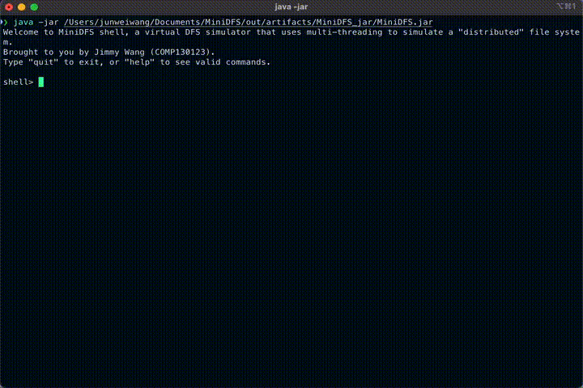

> A animated gif of the MiniDFS shell interface \(MiniDFS Shell接口的动画GIF\)

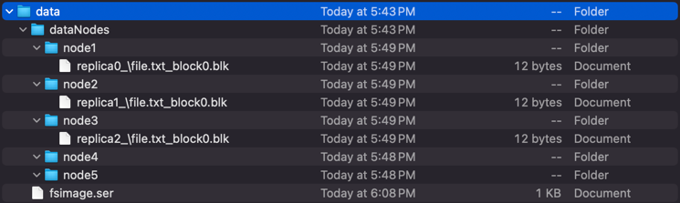

> A screenshot of how the local directory looks like \(本地目录的截图\)

## Features \(功能\)

- **File Chunking and Replication**: Files are split into blocks (4KB by default), with each block replicated across multiple DataNodes for fault tolerance and redundancy.
- **Metadata Management**: The **NameNode** manages the metadata of all files, including their names, sizes, block assignments, and replication information. This metadata is persisted to **fsimage.txt** for recovery upon system restart.
- **Distributed File Operations**: The system supports basic file operations such as:
  - **open**: Allows files to be opened in read or write mode.
  - **write**: Appends data to files, automatically handling the chunking and replication of blocks.
  - **read**: Reads files sequentially from their blocks and reconstructs them.
  - **close**: Updates the file's metadata, persists it to **fsimage.txt**, and ensures data integrity.
  - **delete**: Deletes a file from the file system tree & the physical copies on the data nodes.
  - ```
    Available commands:
        quit: Quit the shell
        lsfs: Displays the current filesystem tree.
        open: Opens a file within the virtual FS in a given mode
        close: Closes a file that was opened (releases the R/W lock).
        write: Writes data from command argument to a "virtual" file.
        write_file: Writes data from an external file to a "virtual" file.
        read: Reads the content of the opened file.
        delete: Delete a file in the "virtual" filesystem
    ```
- **Fault Tolerance**: Data blocks are replicated across multiple DataNodes, ensuring data availability even in the event of a node failure.
- **Persistence**: The **NameNode** persistently stores metadata in a simple text format, enabling recovery after system crashes.
- **Multithreaded Architecture**: The system uses Java’s multi-threading capabilities to simulate communication between clients, NameNodes, and DataNodes, ensuring high concurrency and responsiveness.

> - **文件切块和复制**: 文件被分割成块（默认4KB），每个块在多个数据节点（DataNodes）上进行复制，以确保容错和冗余。
> - **元数据管理**: NameNode管理所有文件的元数据，包括文件名、大小、块分配和复制信息。这些元数据会持久化到fsimage.txt中，以便在系统重启时恢复。
> - **分布式文件操作**: 系统支持基本的文件操作，如：
>     - open: 允许以读取或写入模式打开文件。
>     - write: 向文件追加数据，自动处理块的切割和复制。
>      - read: 顺序读取文件的块并将其重建。
>     - close: 更新文件的元数据，持久化到fsimage.txt，确保数据完整性。
> - **可用命令**：
>     - quit: 退出shell
>     - lsfs: 显示当前的文件系统树
>     - open: 以指定模式打开文件
>     - close: 关闭已打开的文件（释放读写锁）
>     - write: 将命令参数中的数据写入“虚拟”文件
>     - write_file: 将外部文件的数据写入“虚拟”文件
>     - read: 读取已打开文件的内容
>     - delete: 删除“虚拟”文件系统中的文件
> - **容错性**: 数据块在多个数据节点上进行复制，确保即使某个节点故障，也能保证数据的可用性。
> - **持久化**: NameNode持久化存储元数据，使用简单的文本格式，在系统崩溃后能够恢复。
> - **多线程架构**: 系统使用Java的多线程功能，模拟客户端、NameNode和DataNode之间的通信，确保高并发和高响应性。

## "HDFS-like" mechanisms that are implemented

- **Multithreading and Asynchronous Communication**
  - Each node operates concurrently on its dedicated thread, allowing simultaneous task execution and asynchronous messaging.
  - This structure simulates the parallel operation of physically distributed nodes, closely resembling a real-world Hadoop Distributed File System (HDFS).

- **Node Independence and Fault Tolerance**
  - Nodes run independently; therefore, a timeout, exception, or crash in one node or thread does not affect other nodes.
  - Thread-level isolation ensures a robust system, as failures are localized, preventing cascading crashes.
  - As long as the primary (main) thread remains stable and handles exceptions appropriately, the overall system continues operation, providing graceful degradation rather than total system failure.

- **Clear Separation of Responsibilities**
  - Each node has distinct and well-defined responsibilities:
    - **Shell (Main Thread)**: Provides a user interface and orchestrates user commands.
    - **Client Node**: Processes shell commands, coordinates interactions with NameNode and DataNodes.
    - **NameNode (Director)**: Manages metadata, namespace, file/block allocation, replication tracking, and system-wide health checks.
    - **DataNodes (Workers)**: Store file data in blocks, handle read/write requests, manage local storage, and periodically report status to the NameNode.
  - This clear specialization simplifies debugging, maintenance, and system extension.

- **Heartbeat Mechanism for Node Health Monitoring**
  - The NameNode periodically emits heartbeat requests via the centralized message broker to monitor DataNode availability.
  - **Only DataNodes** respond to these heartbeat signals, reporting their status and operational metrics.
  - The NameNode maintains a data structure logging the timestamps of the last valid heartbeat from each DataNode.
    - If a DataNode fails to respond within a predetermined timeout window, it is marked as inactive.
    - This ensures rapid detection of node failures and facilitates proactive data re-replication and recovery actions.

- **Replication and Data Reliability**
  - Files are split into standardized blocks (e.g., 4 KB each) to facilitate storage and efficient data management.
  - Blocks are replicated across multiple DataNodes based on a configurable replication factor, significantly enhancing data reliability and fault tolerance.
  - A round-robin distribution strategy is employed, ensuring balanced and optimized use of available DataNodes for storage and replication.

- **Robust Error and Timeout Handling**
  - The system employs extensive timeout management and comprehensive exception handling mechanisms:
    - All inter-thread and inter-node communications have built-in timeout logic to detect unresponsive nodes or stalled operations.
    - Informative error messages and exception reporting facilitate easier debugging and recovery processes.
  - DataNodes and NameNode can gracefully handle various failures, such as storage issues, network interruptions, or corrupted communications, further enhancing system stability.

- **Persistent Metadata Management**
  - Similar to real HDFS implementations, the NameNode periodically saves metadata state (filesystem namespace, block locations, etc.) to persistent storage (fsimage files).
  - Upon system restart or crash recovery, the NameNode reloads this stored metadata, ensuring consistency and reliability of the filesystem across unexpected shutdowns or system errors.

- **Scalable Design**
  - Threaded, modular architecture supports effortless scaling:
    - Additional DataNodes can be easily integrated into the system without requiring major architectural changes.
    - The round-robin allocation and replication strategies inherently distribute load, preventing any single node from becoming overloaded and enhancing overall system performance.

- **Messaging via Centralized Message Broker**
  - Inter-thread communication leverages a centralized message broker, facilitating asynchronous, efficient, and organized communication among nodes.
  - Each node subscribes to specific message channels relevant to their roles, eliminating unnecessary message traffic and CPU resource usage during idle states.

- **Future-Proofing and Improvements**
  - While the current implementation manages replication logic at the client level, future improvements include delegating replica management entirely to the DataNodes themselves.
  - Such enhancements would further abstract complexity away from the client node, simplifying client-side code, and more closely aligning with official HDFS design patterns.

## Project folder structure

```
.
├── images (images & gifs used in the README)
├── demo (video demo files)
├── src
│   ├── main (source code)
│   │   └── java (com.lab1.distributedfs)
│   └── test (some unit tests)
├── .gitignore              
├── Lab1 分布式文件系统.pdf (lab requirements)
├── large.txt (test data text file)
├── test.txt (test data text file)
├── pom.xml (libraries)
├── README.md
└── README.pdf
```

## What is HDFS and how it works \(什么是HDFS以及它的工作原理\)

The **Hadoop Distributed File System (HDFS)** is a highly scalable and fault-tolerant file system designed for storing and processing large datasets across multiple machines in a distributed manner. Here’s an overview of how HDFS works:

> **Hadoop分布式文件系统**（**HDFS** 是一个高可扩展且容错的文件系统，设计用于在多个机器上存储和处理大规模数据集。以下是HDFS工作原理的概述：

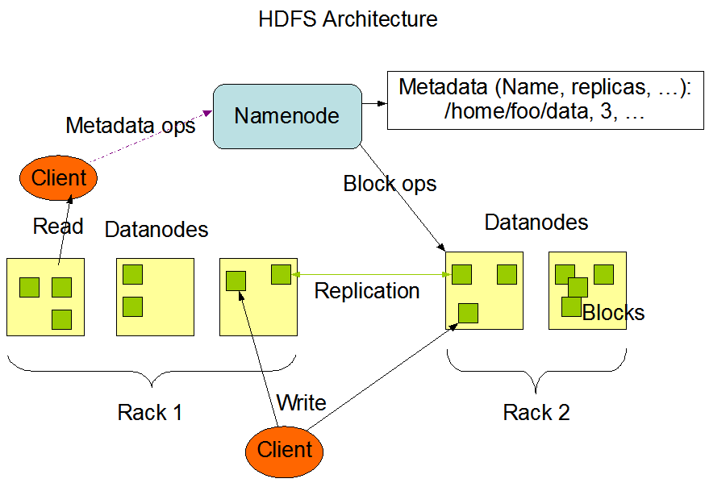

### 1. **Block-Based Storage** \(基于块的存储\)
   - In HDFS, files are divided into fixed-size blocks (default 128MB or 256MB). Each block is stored on different **DataNodes** across the system.
   - **MiniDFS** mimics this by breaking down files into smaller chunks (4KB) for storage on **DataNodes**.
     >   - 在HDFS中，文件被分割成固定大小的块（默认128MB或256MB）。每个块存储在系统中不同的DataNode上。
     >   - MiniDFS通过将文件分解为较小的块（4KB）来模拟这一过程，用于存储在DataNode上。
### 2. **Data Replication** \(数据复制\)
   - To ensure fault tolerance, each block in HDFS is replicated across multiple **DataNodes**. The default replication factor is 3.
   - **MiniDFS** implements a similar approach by creating multiple replicas (default 3 replicas) for each block, which are stored on different **DataNodes**.
     >   - 为了确保容错性，每个HDFS中的块会在多个DataNode上进行复制。默认的复制因子是3
     >   - MiniDFS通过为每个块创建多个副本（默认3个副本）来实现类似的方式，副本存储在不同的DataNode上。
### 3. **NameNode**
   - The **NameNode** is the master of the HDFS architecture. It manages metadata such as file names, block locations, and file-to-block mappings. However, it does not store the actual data.
   - In **MiniDFS**, the **NameNode** performs the same role, keeping track of file metadata (e.g., file name, size, block list) and ensuring metadata persistence in **fsimage.txt**.
     >   - NameNode是HDFS架构的主节点，管理文件名、块位置和文件到块的映射。它不存储实际的数据。
     >   - 在MiniDFS中，NameNode执行相同的角色，跟踪文件的元数据（如文件名、大小、块列表），并确保元数据在fsimage.txt中的持久化。
### 4. **DataNode**
   - **DataNodes** store the actual data blocks. They are responsible for reading and writing data when requested by the client.
   - In **MiniDFS**, **DataNodes** handle the storage of file data in chunks, ensuring that blocks are replicated and persistently stored.
     >   - DataNode存储实际的数据块。它们负责在客户端请求时读取和写入数据。
     >   - MiniDFS中，DataNode处理文件数据的存储，确保块的复制和持久存储。  
### 5. **Client Interaction** \(客户端交互\)
   - Clients in HDFS interact with the **NameNode** to retrieve metadata about a file (like the block locations), and then they directly interact with the **DataNodes** to read/write the data.
   - Similarly, in **MiniDFS**, clients send requests to the **NameNode** for metadata and then perform read/write operations on the **DataNodes**.
     >   - 在HDFS中，客户端与NameNode交互，获取文件的元数据（如块的位置），然后直接与DataNode进行数据的读写操作。
     >   - 类似地，在MiniDFS中，客户端首先向NameNode请求元数据，然后在DataNode上执行读写操作。
### 6. **Fault Tolerance and Recovery** \(容错性和恢复\)
   - In HDFS, if a **DataNode** fails, the system can still retrieve the file by using replicas stored on other **DataNodes**.
   - **MiniDFS** mimics this by replicating blocks across **DataNodes** and using **fsimage.txt** to recover metadata in case of failure.
     >   - 在HDFS中，如果某个DataNode发生故障，系统仍然可以通过使用存储在其他DataNode上的副本来恢复文件。
     >   - MiniDFS通过在多个DataNode上复制块，并使用fsimage.txt在系统故障时恢复元数据来模拟这一过程。

> Refer to the references for details about Hadoop and HDFS

## How to run \(如何运行\)

### Prerequisites:
1. **Java 21 or higher**: Ensure you have Java installed on your machine. You can check the version by running the following command:
   ```bash
   java -version
   ```
    Maybe works with older versions \(but the program was developed using Java 21\).
2. **IDE or Terminal**: You can run the program through your preferred Java IDE (such as IntelliJ IDEA or Eclipse) or directly from the terminal.

You can either clone the repository and then build & run it using IntelliJ, or
download the **release** and directly execute the `.jar` file like so:

> 您可以克隆仓库，然后使用IntelliJ进行构建和运行，或者下载发布版并直接执行.jar文件，如下所示：

```bash
> java -jar /Users/junweiwang/Documents/MiniDFS/out/artifacts/MiniDFS_jar/MiniDFS.jar
```

IntelliJ config for run configurations \(workspace.xml\):
```
    <component name="RunManager" selected="JUnit.FileSystem">
    <configuration name="Main" type="Application" factoryName="Application">
      <option name="MAIN_CLASS_NAME" value="com.lab1.distributedfs.Main" />
      <module name="MiniDFS" />
      <method v="2">
        <option name="Make" enabled="true" />
      </method>
    </configuration>
    <configuration name="FileSystem" type="JUnit" factoryName="JUnit">
      <module name="MiniDFS" />
      <option name="PACKAGE_NAME" value="FileSystem" />
      <option name="MAIN_CLASS_NAME" value="FileSystem.FileSystemTreeTest" />
      <option name="METHOD_NAME" value="" />
      <option name="TEST_OBJECT" value="class" />
      <method v="2">
        <option name="Make" enabled="true" />
      </method>
    </configuration>
    <configuration name="Shell" type="JUnit" factoryName="JUnit">
      <module name="MiniDFS" />
      <option name="PACKAGE_NAME" value="ShellParser" />
      <option name="MAIN_CLASS_NAME" value="ShellParser.ShellParserTest" />
      <option name="METHOD_NAME" value="" />
      <option name="TEST_OBJECT" value="class" />
      <method v="2">
        <option name="Make" enabled="true" />
      </method>
    </configuration>
    <list>
      <item itemvalue="Application.Main" />
      <item itemvalue="JUnit.Shell" />
      <item itemvalue="JUnit.FileSystem" />
    </list>
  </component>
```

## MiniDFS Implementation \(MiniDFS实现\)


To simulate an HDFS-like distributed environment on a single machine, this implementation leverages Java's built-in **multithreading libraries**. Each node type in the system runs concurrently on its dedicated thread, providing a realistic illusion of parallel, independent operation similar to a physical cluster of distributed nodes.

### Threaded Node Structure

The following components run independently, each within their own dedicated thread:

- **Shell Interface (Main Thread)**: 
  - Serves as the user interface, capturing user commands and displaying responses.
- **Client Node**:
  - Manages and forwards requests from the shell to other nodes (NameNode and DataNodes).
  - Handles data-processing tasks before returning responses back to the shell.
- **NameNode** (Director Node):
  - Manages file system metadata, maintains namespace structures, tracks file permissions, file locations, and block allocation.
  - Coordinates DataNodes and monitors system health.
- **DataNodes** (Worker Nodes):
  - Handle block-level storage operations such as block creation, deletion, replication, and processing read/write requests.
  - Multiple instances can run concurrently to simulate real-world distributed storage nodes.

Each thread communicates asynchronously with other threads, requiring careful management using Java's concurrency libraries such as `ExecutorService`, `BlockingQueue`, and related synchronization mechanisms.

---

### Director/Worker Architecture

The system closely follows Hadoop's HDFS **director/worker model**:

- **NameNode (Director)**:
  - Centralized management of file system metadata, such as file locations, directory structures, and block management.
  - Monitors DataNode status via periodic status updates (heartbeat mechanisms).

- **DataNodes (Workers)**:
  - Actual storage units for file data, each node independently handles data block operations.
  - Designed to run on commodity hardware, ensuring cost-effectiveness and scalability.

Communication between the director (NameNode) and workers (DataNodes) occurs through message-passing via a **centralized message broker** to ensure clear separation and efficient asynchronous communication.

---

### Messaging Broker and Inter-node Communication

A central **Message Broker** facilitates asynchronous and organized communication between nodes. This setup allows each node to independently listen for relevant messages without wasting computational resources on unnecessary polling.

**Node Instance Management:**

- The **Shell**, **Client**, and **NameNode** nodes have exactly **one instance each** running at a given time.
- The **DataNode** component supports multiple instances simultaneously (the exact number is configurable through a constants file), simulating a true distributed storage environment.

The main thread primarily manages the shell interface and orchestrates communication between the user interface (shell) and the client node.

---

### Inter-thread Communication (Shell ↔ Client)

The shell interface communicates with the client node through a synchronous **two-way communication channel** implemented via a `BlockingQueue`. 

- **Shell Node** acts as the **command issuer**, forwarding user commands to the client node.
- **Client Node** processes these commands, interacts with other nodes (NameNode, DataNodes), and sends back the processed responses.

This ensures a clean separation of concerns—the shell node does not directly handle internal system complexity, delegating command execution logic entirely to the client node.

#### Communication Implementation Example:

**From `Command.java`:**  
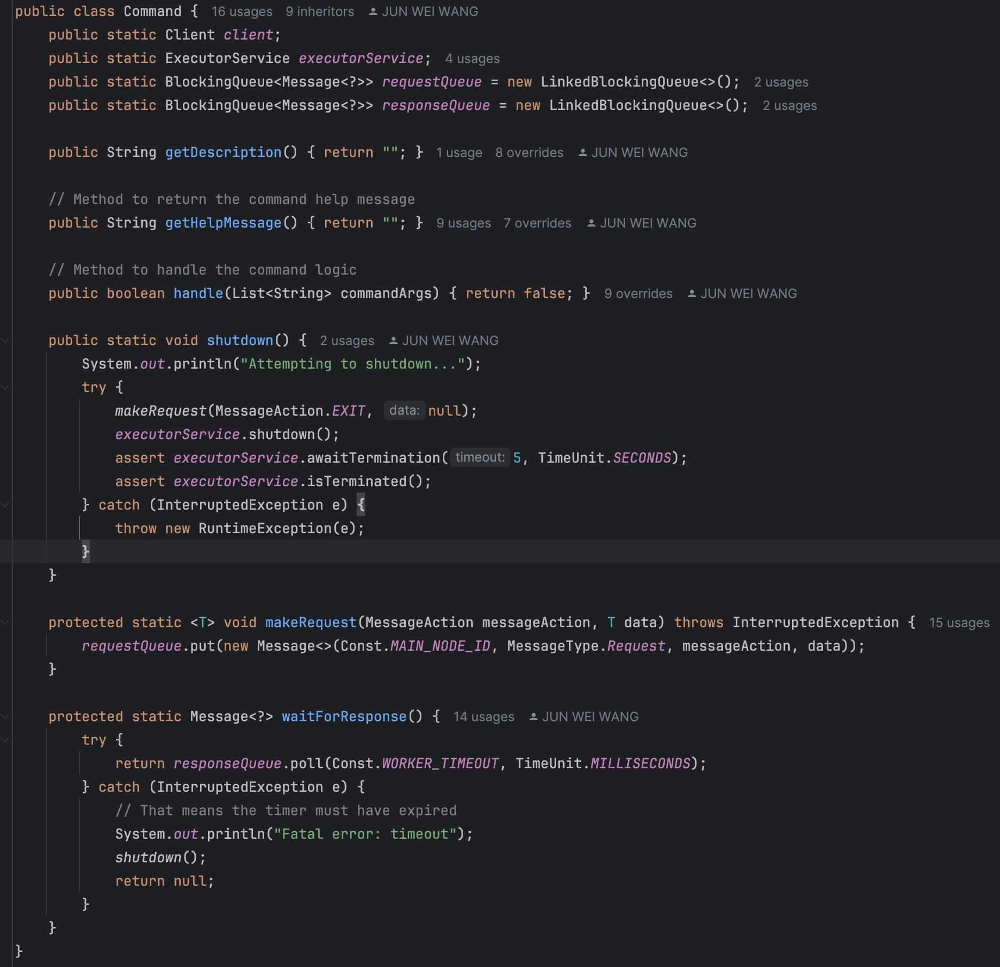

**From `Client.java`:**  
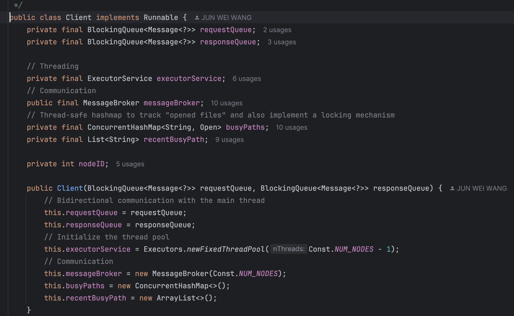

---

### Message Action State Diagram

The following diagram illustrates possible states of messages exchanged within the system, detailing interactions and expected responses between different nodes:

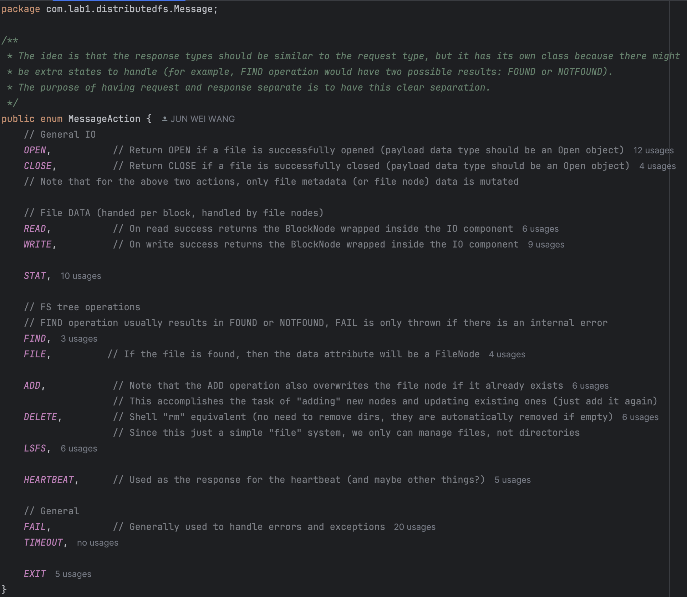

---

### Handling "Write" Requests

Write requests involve communication from the shell → client → NameNode/DataNodes. Each "write" command from the user triggers the following sequence:

- Client opens file via NameNode.
- Client obtains DataNode statuses and selects optimal nodes for data replication.
- Client sends data in blocks, distributed via round-robin assignment across DataNodes, ensuring balanced load distribution and data redundancy.
- DataNodes confirm successful write operations back to the client, which updates the metadata via the NameNode.

---

### Multithreading Visualization (Debugging Thread Dump)

The following screenshot shows an IntelliJ IDEA debugging interface, highlighting concurrent threads actively running, each responsible for its designated task:

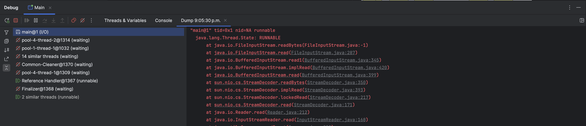

> Note the presence of multiple active threads, demonstrating effective concurrency.

---

### DataNode Implementation

In this implementation, the DataNode manages essential tasks related to storage management, specifically handling:

- **READ** operations (retrieving data blocks from storage)
- **WRITE** operations (persisting data blocks to storage)
- **HEARTBEAT/STAT** operations (reporting current status and availability)
- **EXIT** operation (clean termination upon shutdown)

Each DataNode maintains its own isolated **storage directory**, structured based on the node's unique ID. DataNodes continuously listen to incoming messages via subscriptions to the message broker. The system employs efficient blocking mechanisms, avoiding unnecessary computational overhead while idle.

#### Implementation Example (from `DataNode.java`):

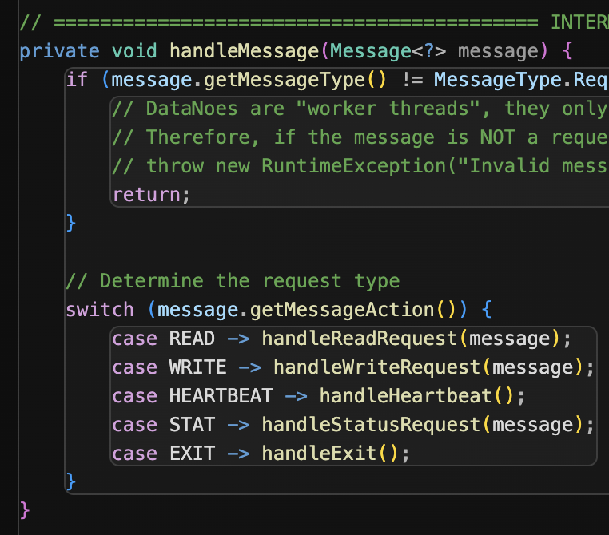

- Read and write actions directly interact with the DataNode’s local filesystem, manipulating blocks stored as files.
- The `HEARTBEAT` and `STAT` actions originally implemented separately can be unified, mirroring Hadoop's actual design, where heartbeat messages inherently contain status reports.

**Replication management note:**  
Currently, the replication logic is implemented in the client/main thread, simplifying initial setup but limiting flexibility. Ideally, **replica management** responsibilities should shift directly to DataNodes and NameNode interactions, abstracting complexity away from the client node and allowing seamless management of data redundancy and fault tolerance.

---

### NameNode Implementation

The NameNode maintains overall control and metadata management, specifically handling:

- Namespace management (directories, files)
- Data replication coordination
- Metadata such as file permissions, block locations, and file ownership (similar to the role of Inodes in traditional filesystems)

Due to a minor misunderstanding during initial design, certain file management operations (open/close file tracking) were incorrectly placed within the client node. Ideally, the NameNode should globally handle file open/close states to ensure consistency across multiple concurrent clients and prevent potential conflicts, such as multiple clients simultaneously accessing the same file.

The NameNode listens via subscription to the message broker and handles these message actions:

- **LSFS** (listing file system structure)
- **FIND** (file searching)
- **ADD** (adding new files or blocks)
- **DELETE** (removing files)
- **STAT** (node status updates)
- **EXIT** (clean termination)

Implementation example (from `NameNode.java`):

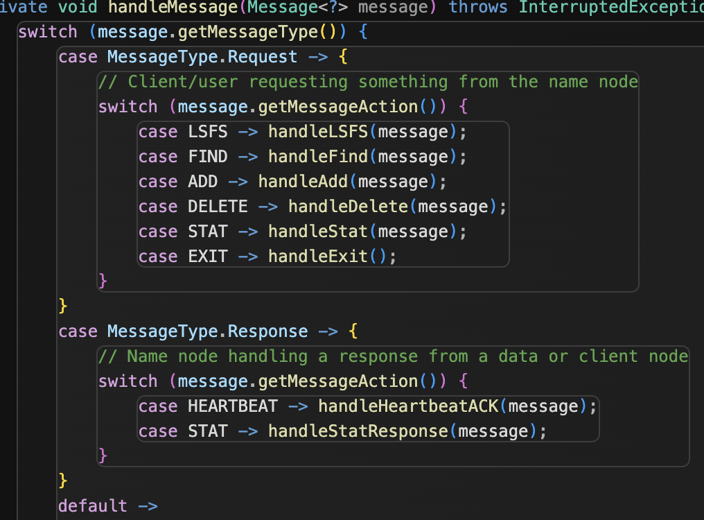

Properly centralizing open/close management in the NameNode ensures robust control and avoids potential synchronization issues that might arise when scaling to multiple client nodes.

## Demos & Experiment Results (演示与实验结果)

Below are GIFs and screenshots demonstrating the implemented features:

- Opening and closing a file
- Writing small data directly from the shell to a DFS file
- Writing external data (a large text file) into a DFS file
- Deleting a file from the DFS
- Persistence of metadata information stored in the NameNode across system restarts

---

### Opening and Closing a File (打开与关闭文件)

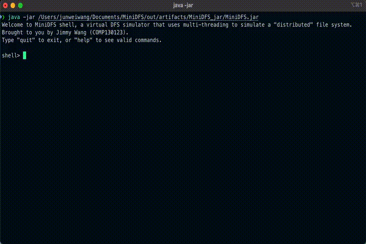

- The path provided to the `open` command is interpreted as the full path to a file. 
- If any parent directories in the specified path **do not exist**, they are **automatically created**.
- Users can open multiple files simultaneously. However, subsequent file operations will default to the **most recently opened** file, unless another specific file is explicitly specified.
- The `close` command closes files starting from the most recently opened. Users can also explicitly specify the file path of the file they wish to close individually.

---

### Writing Data to a File (向文件写入数据)

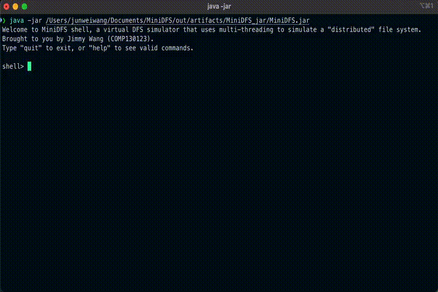

- Once a file is successfully opened, users can perform **write operations**.
- Data provided through the `write` command is automatically **appended** to an existing block if the block has sufficient free space. If the existing blocks are full, a new block is created to accommodate the new data (demonstrated clearly in the external file-writing demos).
- After writing data, users can use the `read` command to retrieve and view the stored data, which is decoded and displayed as a UTF-8 string.

---

### Writing External Data to a File (从外部文件写入数据到文件)

**Writing a single large file to the DFS:**


**Writing a large file multiple times to the DFS (multiple blocks):**


- When writing a large external file that exceeds the size limit of a single block (e.g., 4 KB), the system splits the data into multiple blocks and distributes them across available DataNodes using a round-robin method.
  - This approach **prevents individual DataNodes from being overloaded**, ensuring balanced storage across nodes.
  - Technically, there is no enforced file-size limit. However, larger files may become increasingly susceptible to partial data loss if any DataNode storing replicas experiences a failure.
- The demonstrated large external file has an exact size of **8 KB**. After writing it once and subsequently appending more data to it, the newly added data is seamlessly stored into a newly allocated block.
  - These demonstrations validate that the implementation correctly handles the appending of additional data into partially filled blocks, as well as the simultaneous writing of multiple blocks.

**File system structure after performing the above writes:**

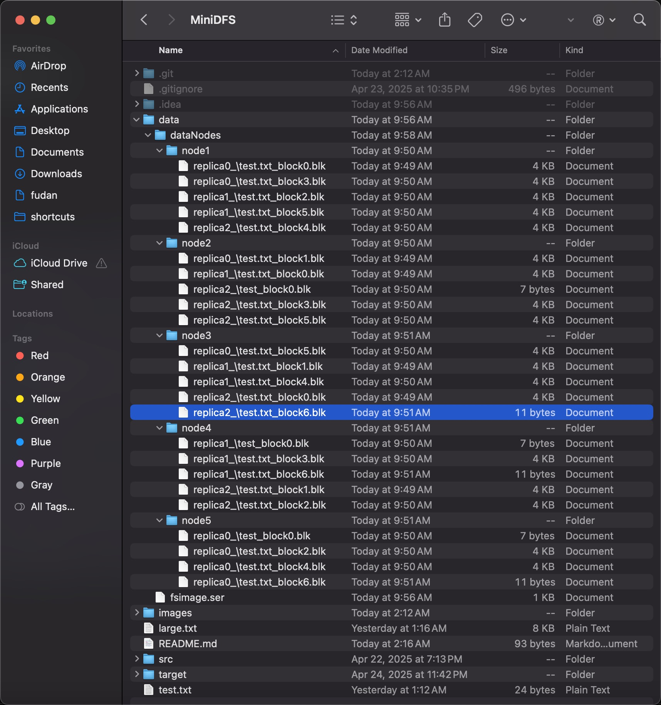

---

### Deleting a File (删除文件)

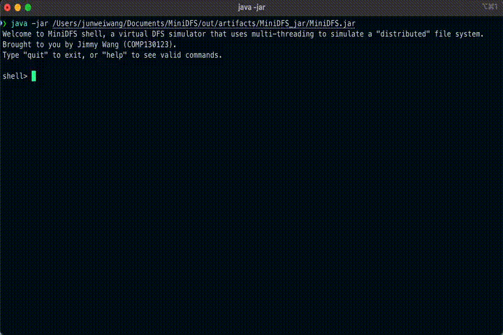

- The delete command removes the file metadata from the NameNode and instructs relevant DataNodes to free up storage occupied by the associated blocks.
- After deletion, any subsequent attempt to access the file correctly results in an error message indicating the file's nonexistence, ensuring consistent system behavior.

---

### Persistence (持久化)

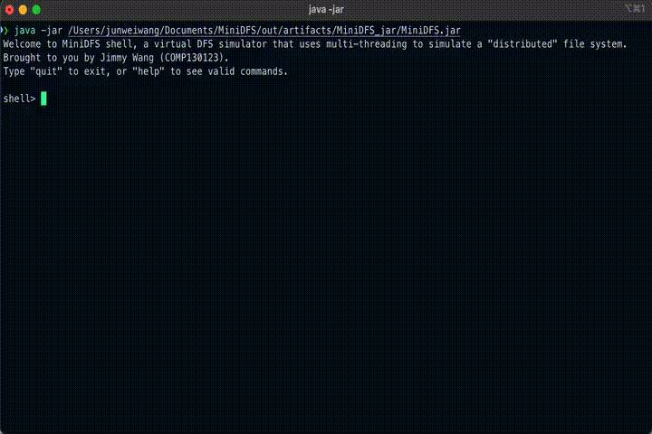

- Metadata managed by the NameNode (such as file names, directory structures, block allocations, and replication details) is periodically persisted to a file (`fsimage.txt`) on disk.
- Upon system restart or recovery after a failure, the NameNode reloads metadata from persistent storage, maintaining **consistency and reliability** of the file system's metadata.
- This persistence mechanism safeguards against complete metadata loss during unexpected crashes, enabling smoother and faster recovery.

## Problems & conclusion/summery

> All code in this project were hand written, no ChatGPT or deepseek was using. The only LLM used are some ideas, organization, and formatting that were contribtued to this README file
or lab report.

## References

- https://hadoop.apache.org/docs/r1.2.1/hdfs_design.html
- https://www.ibm.com/think/topics/hdfs
- https://github.com/timothyekl/ShellParser
- http://baeldung.com/java-concurrent-queues